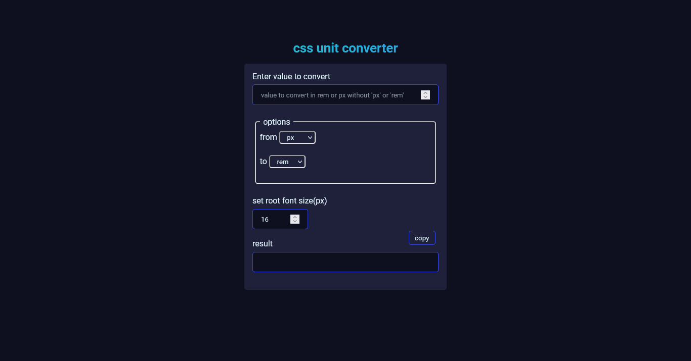

# CSS unit converter

This is simple tool I created when I began working with figma design files. I noticed that all(I guess) of the measurements were given in `px` and I figured that building a tool to make it easier for me to covert from `px` unit to `rem` unit will be helpful to me
There might be a tool out there that does this same thing but I had a great time building it out. I got to understand better how Typescript works :D.

## Project Screenshot

This is a screenshot of how the CSS unit converter looks like on desktop screens

### What I might improve?

I'd work towards making this project more accessible :)

### helpful resoures

- I got the code of the beautiful header text from [this codepen](https://codepen.io/Arwym/pen/vJyPKo)
